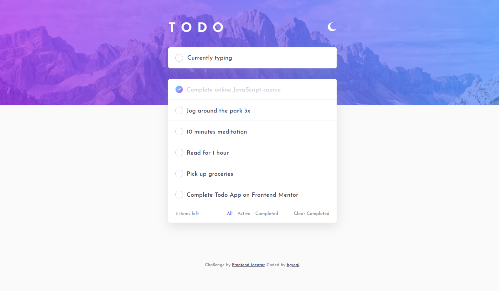

# Frontend Mentor - Todo app solution

This is a solution to the [Todo app challenge on Frontend Mentor](https://www.frontendmentor.io/challenges/todo-app-Su1_KokOW). Frontend Mentor challenges help you improve your coding skills by building realistic projects. 

## Table of contents

- [Overview](#overview)
  - [The challenge](#the-challenge)
  - [Screenshot](#screenshot)
  - [Links](#links)
- [My process](#my-process)
  - [Built with](#built-with)
  - [What I learned](#what-i-learned)
  - [Continued development](#continued-development)
  - [Useful resources](#useful-resources)
- [Author](#author)
- [Acknowledgments](#acknowledgments)

## Overview

### The challenge

Users should be able to:

- View the optimal layout for the app depending on their device's screen size
- See hover states for all interactive elements on the page
- Add new todos to the list
- Mark todos as complete
- Delete todos from the list
- Filter by all/active/complete todos
- Clear all completed todos
- Toggle light and dark mode
- **Bonus**: Drag and drop to reorder items on the list

### Screenshot

### Links

- Solution URL: [https://github.com/bgregi/fm-todo-app](https://github.com/bgregi/fm-todo-app)
- Live Site URL: [https://bgregi.github.io/fm-todo-app/](https://bgregi.github.io/fm-todo-app/)

## My process

### Built with

- CSS custom properties
- SASS
- Flexbox
- Mobile-first workflow
- Javascript

### What I learned

This was a great challenge for me. It was the most JavaScript-heavy project I've made so far, which was really good for my vanilla JS skills. I had to come up with a variety of functions for the many functionalities of the challenge, and that made me have to search for other peoples codes online and to come up with my own solutions too.

It was the first project I did with light/dark themes, so I came up with my own strategy for changing the styles, which I'm not sure is the best one possible, so I intend to research about this topic in future projects.

Overall, I really liked doing this and look forward for the next one.

## Author

- Website - [bgregi's GitHub Profile](https://github.com/bgregi)
- Frontend Mentor - [@bgregi](https://www.frontendmentor.io/profile/bgregi)
